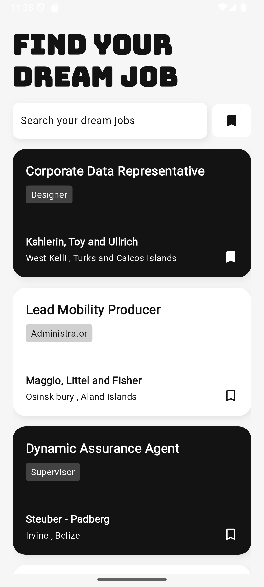
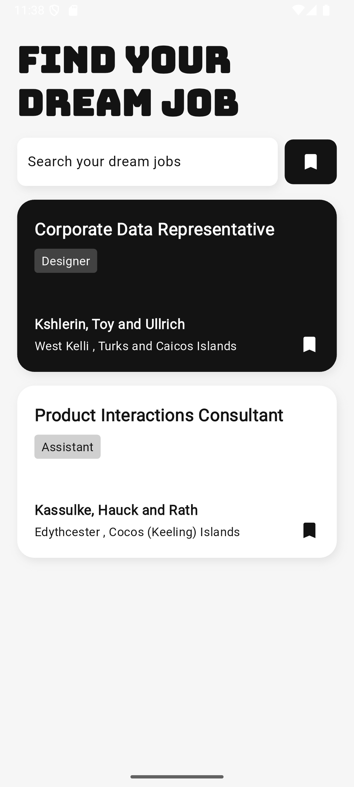
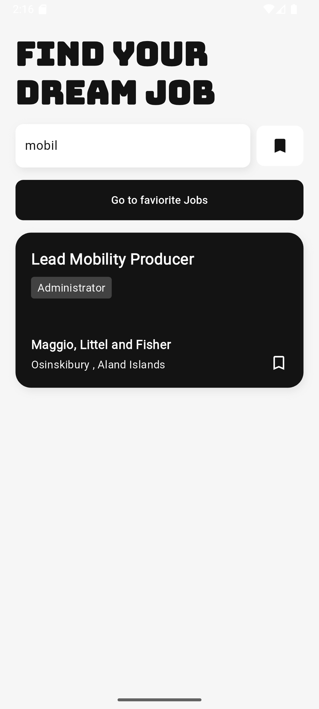
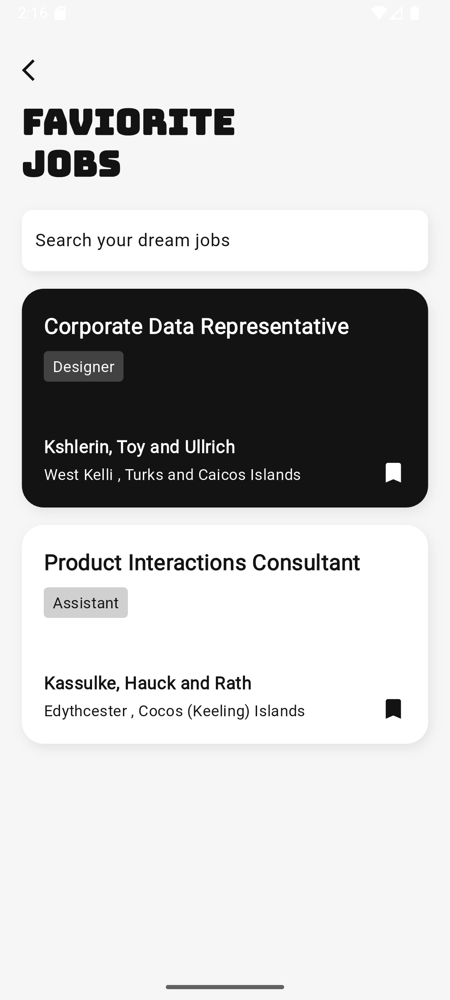
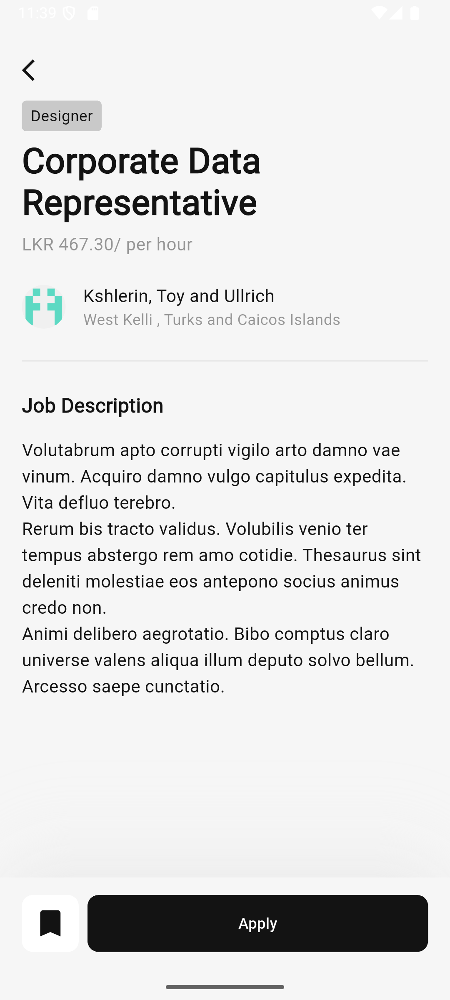
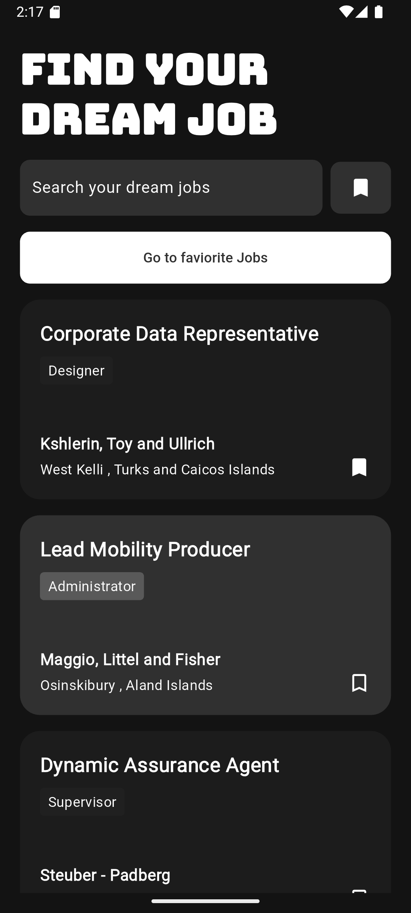
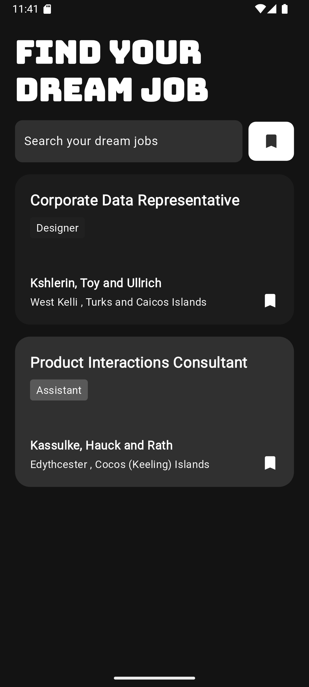
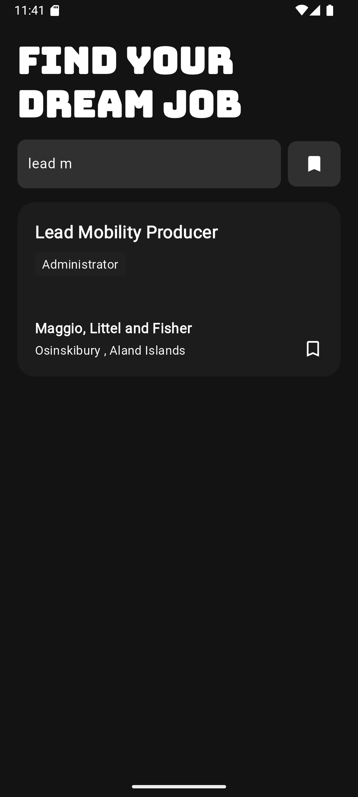
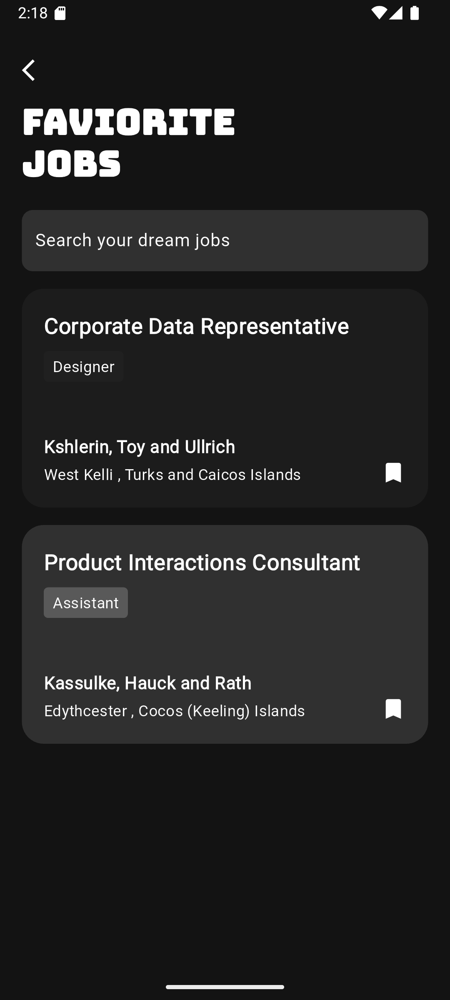
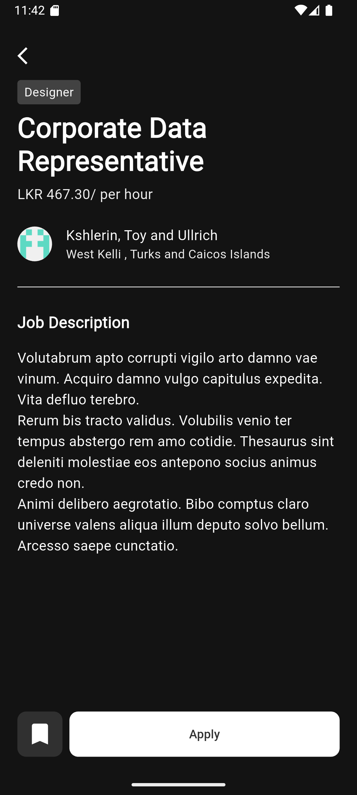

# job_app

This app is created with flutter. Used https://mockapi.io/ for generating mock APIs.

### Features
* Scrollable job list
* Add to bookmark (faviorite)
* Check all the details of job
* Filter bookmark (faviorite) jobs
* Dark and light mode change with system mode
  
## Getting Started

### Versions
- [Flutter SDK: 3.27.0](https://docs.flutter.dev/install/archive)

### Installation

#### 1. Clone the repository
   ```bash
   git clone https://github.com/himashagunasena/job_app.git
   ```
#### 2. Install dependencies
```bash
flutter pub get
```
#### 3. Run the app
```bash
flutter run
```
## Architecture and state managments
Used MVVM architecture with provider for easily manage the presentation and logic layers.
#### Folder structure
- `main.dart` - Entry point of the app
- `screens` - Presentation layer (view)
   - `widget` - Contains the reusable components
- `core ` - Contains the api calls. It acts like as logic (model) layer
- `model ` - Contains the response models. Created the models by using [quicktype](https://app.quicktype.io/)
- `provider ` - It is the view-model. Mange the states of presenation layer and pass the data between view (presentation layer) and model (logic layers)
- `utils` - Manage consts and common classes
   - `storage` - Contains sharedpreference classes

## Screenshots
| Dashboard | Faviorite Jobs Filter | Search | Faviorite Jobs Screen |  Job Details view |
| ----------------|---------------|---------------|----------------|----------------|
|  |  |  |  |  |
|  |  |  |  |  |
